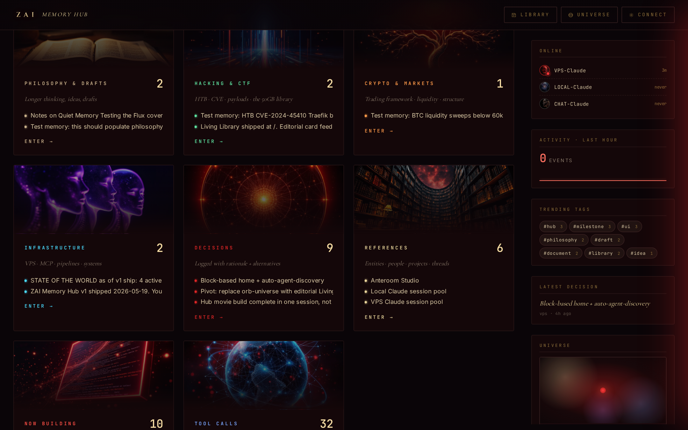
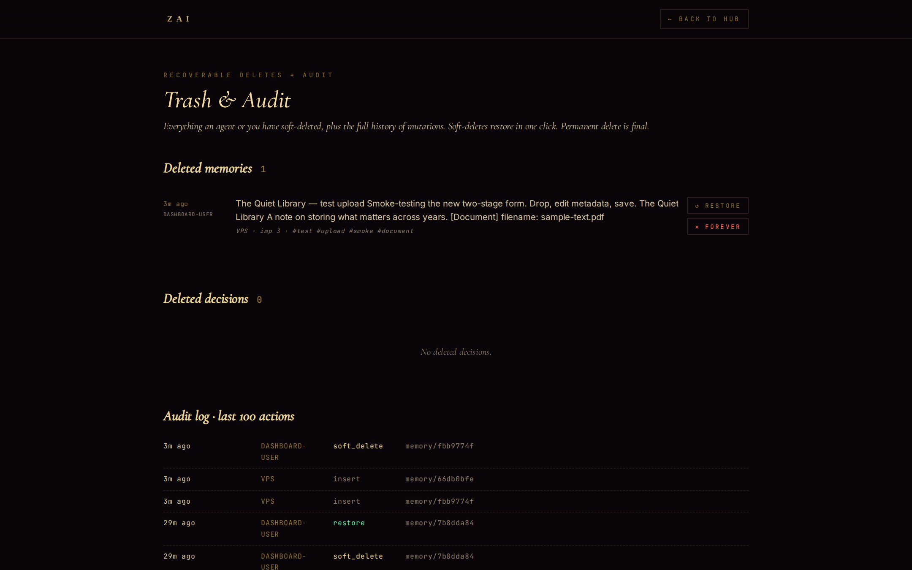

# zai-memory-hub

A self-hosted memory store I built so that every AI assistant I use writes to the same Postgres. Claude.ai web, Claude Code on my VPS, Claude Code on my laptop, Cursor, Cline, a hand-rolled Python script - they all hit one MCP endpoint and share one database. The dashboard is where I actually go look at what they've written.

I'm putting it up because friends kept asking how the agent-shared memory works. The repo is the skeleton: fork it, point it at your own Postgres, fill it with your own context. Don't import my memories - the whole point is that the data is yours.


## Why this exists

Most "memory" features for LLM tools are scoped to one client. Claude.ai web doesn't see what Claude Code on my VPS wrote yesterday. Cursor doesn't know I already decided not to use Redis. The fix everyone keeps re-inventing is some flavor of "stuff a markdown file in a folder and load it on session start," which works until you have more than one device or more than one assistant.

This is the version of that I actually use. One Postgres, one MCP endpoint, per-agent bearer tokens with role-based access, a dashboard with a delete button. Everything is append-mostly: agents can write and soft-delete, but only the human (through the dashboard) can hard-delete. The audit log tracks every mutation.

## What you get (v0.5)

**MCP tools** — fourteen of them, all defined in `server/hub.py`:

*Atomic writes / search*

- `context.bootstrap` — one-call orientation when an agent first connects (recent decisions, recent memories, your own writes, who else is online, role-appropriate house rules).
- `memory.add` — write a one-line atomic memory with tags + importance. Server-side content-similarity dedup. PII scanner blocks 14 credential patterns at write time.
- `memory.add_full` — for long-form content the human wants preserved verbatim. Title + full markdown body (up to 200 KB) → auto-renders a PDF, attaches it to the memory, surfaces an "Open PDF" button + inline iframe preview on the dashboard reader. Trigger phrases the human typically uses: "save as is", "save with context", "proper save karo".
- `memory.recall` — search by text. Returns ~200-char summaries by default; pass `full=true` for full bodies. Substring match today, semantic upgrade ready when you wire a Voyage key.
- `memory.get_recent` — latest N memories, optionally filtered by author or tag.
- `memory.delete` — soft, recoverable, audited. Admin-only role; hidden from writer-token tool catalogs.

*Course-correction + entities*

- `decision.log` — durable decisions other agents should respect, with rationale + alternatives + supersedes-chain.
- `entity.upsert` — first-class entities (`person | project | thread | repo | location | concept | event` — server-enforced enum). Memories attach to entities.
- `entity.neighborhood` — walk the knowledge graph from any entity. Returns memories + decisions + co-occurring entities for that node.
- `interaction.log` — mark session start, end, or turning point so concurrent agents see who's working on what.

*Ephemeral chat capture*

- `chat_window.create` — dump a recent conversation transcript (≤600 lines / 64 KB, tail-preserved) as an ephemeral window with a 10-day TTL. Useful when the human says "save this chat".
- `chat_window.list` / `chat_window.get` — list and fetch full transcripts.
- `chat_window.pin` — keep a window past its TTL (admin).
- `chat_window.delete` — soft-delete a window (admin).

A daily cleanup cron soft-deletes expired, unpinned chat windows.

**Auth model** — per-agent tokens in a Postgres table, each bound to one **slug** + one **role**:

- `admin` — all tools, including delete
- `writer` — read + write, no delete (the default for new agents)
- `recall-only` — read-only

The server stamps every write's `written_by` from the token row. **Clients cannot lie** about which agent they are. The MCP `tools/list` response is also filtered by role, so a writer-token Claude never sees `memory.delete` in its catalog (no "I have this tool but it 403s" confusion).

**OAuth 2.0 with Dynamic Client Registration** so Claude.ai web (or any MCP-aware OAuth client) can auto-register and walk through a consent flow. No manual token-pasting on the agent side.

**Dashboard** (FastAPI, no JS framework) at the same domain:
- `/` — blocks home: knowledge blocks per tag set, active agents row, recent activity ticker
- `/library` — PDF vault with title/description/tags form + optional Flux cover art per upload
- `/graph` and `/graph/<entity>` — entity-centric knowledge graph exploration
- `/agents` — mint, list, revoke per-agent tokens. Phone-friendly.
- `/trash` — soft-deleted memories + restore button + full audit log
- `/connect` — connection wizard with copy-paste configs for popular MCP clients
- `/health` — public status probe (no auth) for graceful client-side degradation

**Blocks** ship with sensible defaults. Each is just a tag set the dashboard groups; edit `BLOCKS` in `dashboard/app.py` to add your own.

| Block | Tags it groups | What goes there |
|-------|----------------|------------------|
| Philosophy | `philosophy`, `essay`, `thought` | Long-form reflections |
| Hacking & CTF | `htb`, `ctf`, `pwn`, `exploit`, … | Writeups, payloads, recon notes |
| Crypto & Markets | `crypto`, `market`, `regime`, `liquidity` | Trading thinking |
| Infrastructure | `infra`, `vps`, `mcp`, `systemd`, `pipeline` | System / deployment notes |
| Now Building | `milestone`, `ship`, `in-flight`, `feature` | Current shipping work |
| Decisions | _(kind: decisions)_ | `decision_log` entries |
| References | _(kind: entities)_ | Entity-card view |
| Chats | _(kind: chats)_ | Ephemeral chat windows (10-day TTL) |
| Tool Calls | _(kind: tools)_ | Recent MCP invocations |
| GitHub Projects | `github-project` | Your repo portfolio (see `scripts/build_github_projects_block.py`) |

**Bring your own knowledge** — the GitHub Projects example shipped in `scripts/`. Run once and your public + private repos (with READMEs + topics + language + visibility) all become recall-able memories. A `~/.github_projects_state.json` fingerprint tracks the last `pushed_at`, so re-runs only re-push repos that actually changed. Adapt the same pattern for any data source (Linear tickets, Notion pages, your reading list).

**Off-site backups** — nightly Postgres dump + uploaded PDFs mirror to Backblaze B2 (server-side AES-256 encryption by default). The whole hub also has an `/api/export` endpoint that streams everything as one JSON file you can take to any other Hub install.

## What it costs to run

For one person plus a handful of agents:

| Component | Cost |
|---|---|
| VPS | $5-10/mo (any 2GB Linux box) |
| Domain | ~$12/yr |
| Postgres | $0, runs on the VPS |
| B2 backup | a few cents/mo for the first GB |
| Replicate cover art *(optional)* | ~$0.04 per generated cover |
| Voyage embeddings *(optional, for semantic recall)* | free tier covers a single user |

Everything past VPS + domain is optional.

## Quick install

Assumes Ubuntu 24.04 with a domain pointed at the box. You need root once.

```bash
git clone https://github.com/Zawwarsami16/zai-memory-hub.git
cd zai-memory-hub
cp .env.example .env
$EDITOR .env
```

Edit `.env` and at minimum set: `ZAI_HUB_DSN`, `ZAI_HUB_DASHBOARD_KEY`, `ZAI_HUB_PUBLIC_URL`.

```bash
# Postgres
sudo apt install -y postgresql-16 postgresql-16-pgvector
sudo -u postgres psql <<SQL
CREATE USER zai_hub WITH PASSWORD 'change-me';
CREATE DATABASE zai_hub OWNER zai_hub;
SQL
sudo -u postgres psql -d zai_hub -f db/001_init.sql
sudo -u postgres psql -d zai_hub -f db/002_soft_delete_audit.sql
sudo -u postgres psql -d zai_hub -f db/003_agent_tokens_oauth.sql

# Bootstrap an admin token for yourself (write it down — you'll use it for the first agent connection)
ADMIN_TOKEN=$(python3 -c "import secrets; print('zai_' + secrets.token_urlsafe(32))")
HASH=$(printf '%s' "$ADMIN_TOKEN" | sha256sum | cut -d' ' -f1)
sudo -u postgres psql -d zai_hub -c "
INSERT INTO agent_tokens (token_hash, slug, role, label, issued_via)
VALUES ('$HASH', 'me-admin', 'admin', 'bootstrap admin', 'bootstrap');"
echo "Your admin token: $ADMIN_TOKEN  (save this; it won't be shown again)"

# Python
python3.12 -m venv .venv
.venv/bin/pip install -r requirements.txt
set -a; source .env; set +a
.venv/bin/python server/run_http.py &
.venv/bin/python -m uvicorn dashboard.app:app --host 127.0.0.1 --port 8766 &
```

For production: put Caddy in front (sample at `deploy/Caddyfile.example`), run both services under systemd (samples in `deploy/`), and schedule `scripts/backup_to_b2.py` as a nightly cron.

## Connecting an agent

**Claude.ai web** (recommended path — uses OAuth):

1. Settings → Connectors → Add custom connector
2. Name: `My Memory Hub`
3. Remote MCP server URL: `https://your-hub.example.com/mcp`
4. Leave OAuth Client ID / Secret blank (DCR auto-registers)
5. Click Add. You'll be redirected to a consent screen on your hub — log into the dashboard first, then approve. A bearer token is minted, bound to the slug you picked.

**Claude Code** (or any MCP client that supports HTTP headers):

```bash
claude mcp add zai-hub --transport http \
  --url https://your-hub.example.com/mcp \
  --header "Authorization: Bearer $ZAI_HUB_TOKEN"
```

**Cursor, Cline, custom scripts** — same pattern. Any MCP client that speaks Streamable-HTTP works.

The first time any agent connects, point it at [`AGENTS.md`](AGENTS.md) — that file is the etiquette that keeps concurrent agents from clobbering each other.

## Screenshots

Blocks home (knowledge blocks per tag, recent activity, side rail):



Trash + audit (every mutation, restorable):



## Portability — moving your hub

Two commands. The exporter streams (no memory pressure on big dumps), the importer is idempotent.

```bash
# on the old host
curl -b cookies.txt https://old.example.com/api/export -o hub-export.json
tar czf uploads.tgz dashboard/static/uploads/

# on the new host (fresh install of this repo, run db/00*.sql migrations first)
ZAI_HUB_DSN='host=... dbname=zai_hub user=... password=...' \
  python scripts/import_export.py hub-export.json
tar xzf uploads.tgz -C ./
```

UUIDs are preserved, so foreign-key references survive. `agent_tokens` come along too (you'll want to revoke + re-mint after migration for hygiene).

## Security model

- **No anonymous reads or writes.** Every MCP request needs a valid bearer token in `Authorization: Bearer …`. Backend validates against the `agent_tokens` table (sha256-hashed; raw tokens never logged or stored).
- **Three roles** (`admin` / `writer` / `recall-only`) enforced both at tool-catalog time (so unauthorized tools don't even appear in `tools/list`) and at call time (defensive).
- **Server-side attribution**: every write's `written_by` is stamped from the token's slug. Clients cannot override it.
- **PII scanner** blocks 14 credential patterns (OpenAI/Anthropic/Replicate keys, GitHub PATs, AWS access keys, JWTs, PEM private key blocks, `password = …` lines) at write time. Rejections are audit-logged. Override via `acknowledge_unsafe=true` for legitimate format-docs.
- **OAuth 2.0 DCR** means agents like Claude.ai web auto-register; the human approves on a consent screen that requires a fresh dashboard login.
- **Soft delete + audit log**: every mutation logs to `audit_log` (`target_kind`, `target_id`, `action`, `actor`, `detail`). Hard delete is dashboard-only.
- **Encryption in transit**: Caddy auto-TLS via Let's Encrypt. SSL on for psql connections.
- **Encryption at rest**: B2 backups are AES-256 SSE-B2 by default. VPS disk is plain ext4; see [`docs/SECURITY_POSTURE.md`](docs/SECURITY_POSTURE.md) for honest assessment + 3 migration paths.

## What's intentionally not here

- **Multi-tenant SaaS.** This is a single-person tool. If you fork it for a team, the bearer model is fine but you'd want to add an org concept.
- **A reset / wipe button.** The export → restart path is the wipe path.
- **Edits to existing memories.** Append a superseding memory; don't mutate. `decision.log` has a `supersedes` field for the same reason.
- **Anything Slack-like** (channels, threads, presence). Interactions are a log, not a chat.

## Roadmap

In rough order:

- **Semantic recall** via Voyage embeddings. Plumbed in v0.5; just point `VOYAGE_TOKEN_PATH` at a key file and writes start getting embedded. ivfflat cosine index over pgvector.
- **Read-only public-share mode** for individual memories (signed URL, time-boxed).
- **Tiny CLI** (`zai-hub recall "what was that thing about..."`) for one-shot terminal queries without MCP — already in `scripts/cli.py`.
- **Source ingesters** for the common cases — RSS, Linear, Notion, GitHub Issues — built on the same pattern as `scripts/build_github_projects_block.py`.

If you fork this and add something useful, send a PR.

## License

MIT. See [LICENSE](LICENSE).
